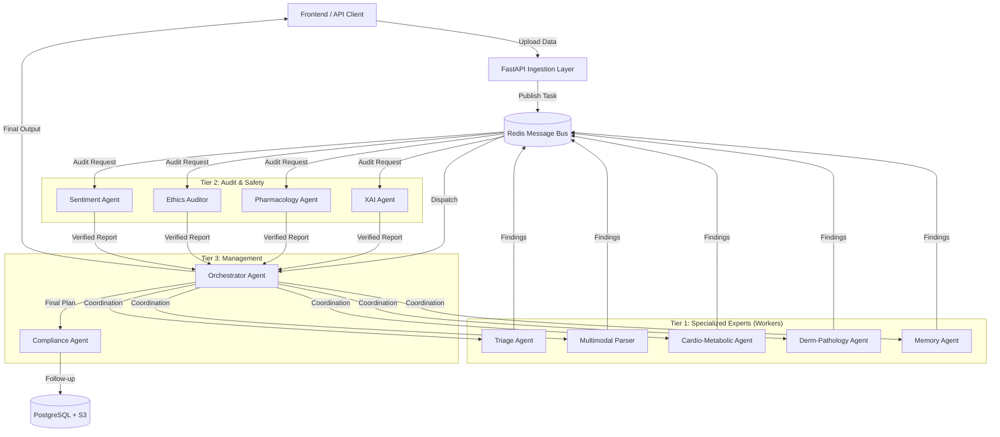

# Architecture: NeuralMedic Multi-Agent System 🏥

## High-Level Overview
The system follows an **Asynchronous, Event-Driven Hub-and-Spoke Architecture**. It is designed to process multimodal medical data (Images, PDFs, Text) through a collaborative "Medical Board" of 11 specialized agents.

## Core Components

### 1. Ingestion Layer (FastAPI)
*   **Role**: Zero-latency entry point.
*   **Action**: Receives PDFs/Images, generates a Task ID, and pushes the payload to Redis.
*   **Urgency Filter**: Preliminary check (Rule-based) to tag requests as Red/Yellow/Green before queuing.

### 2. Message Broker (Redis)
*   **Priority Queues**:
    *   `critical_queue`: Heart spikes, severe symptoms (Processed immediately).
    *   `default_queue`: Routine checkups, dermatology scans.
*   **Event Bus**: Pub/Sub mechanism for inter-agent communication without tight coupling.

### 3. The 11-Agent Intelligence Framework
The "Brain" of the system is split into three functional tiers:

#### Tier 1: Specialized Experts (The Workers)
*   **Triage Agent**: Conducts adaptive patient interviews.
*   **Multimodal Parser**: Extracts text/tables from PDF lab reports.
*   **Cardio-Metabolic Agent**: Analyzes ECGs, heart rate, and glucose trends.
*   **Derm-Pathology Agent**: Vision model for skin lesions and hair analysis.
*   **Memory Agent**: RAG-based lookup of historical patient records.

#### Tier 2: Audit & Safety (The Fact-Checkers)
*   **Explainability (XAI) Agent**: Links every diagnosis to specific evidence (e.g., "Page 3, Line 12").
*   **Pharmacology Agent**: Checks for drug interactions and allergies.
*   **Ethics Auditor**: Checks for bias in diagnosis.
*   **Sentiment Agent**: Analyzes patient tone/anxiety levels.

#### Tier 3: Management (The Bridge)
*   **The Orchestrator**: The "Chief Medical Officer". Aggregates all findings into the structural report.
*   **Compliance Agent**: Generates post-visit follow-up plans and adherence checks.

### 4. Storage Layer
*   **PostgreSQL**: Stores structured patient data, agent findings, and reasoning paths.
*   **S3 / MinIO**: Object storage for raw artifacts (High-res images, PDF documents).

## Data Flow
1.  **Ingest**: User uploads data via Frontend -> API.
2.  **Triage**: `Triage Agent` assesses urgency.
3.  **Analyze**: Orchestrator dispatches parallel tasks to Tier 1 Experts (Cardio, Derm, etc.).
4.  **Audit**: Tier 2 Agents verify findings and check safety.
5.  **Synthesize**: Orchestrator compiles the "Clinical Case File".
6.  **Store**: Results saved to DB; Artifacts to S3.
7.  **Respond**: Doctor receives the dashboard; Patient receives the "Health Snapshot".
