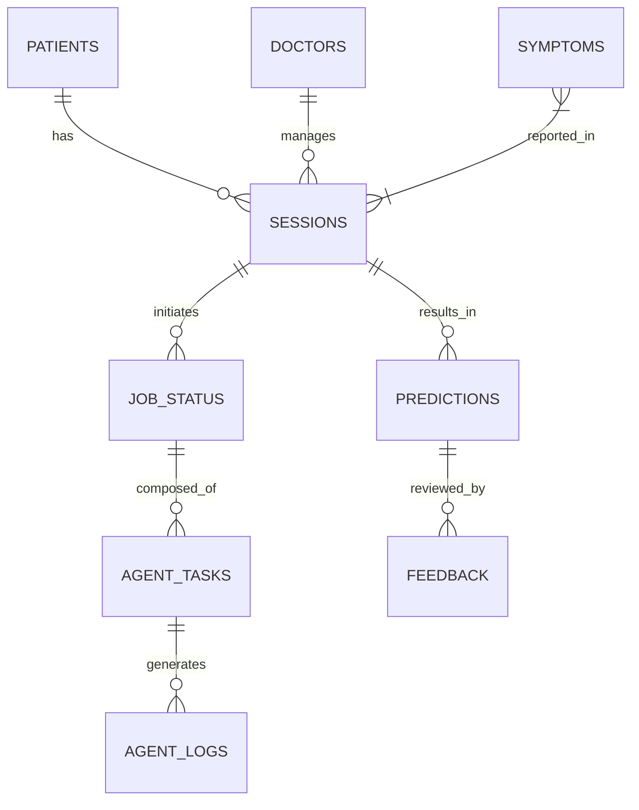

# DATA_CONTRACTS.md

## High-Level Entity Relationship Diagram (ERD)



## 1. Core Domain Schema

### `patients`
Stores all patient demographic and medical history data.
```sql
CREATE TABLE patients (
    id UUID PRIMARY KEY DEFAULT gen_random_uuid(),
    user_id UUID, -- Optional link to auth system
    full_name VARCHAR(255),
    dob DATE,
    gender VARCHAR(50),
    medical_history_summary TEXT,
    created_at TIMESTAMP WITH TIME ZONE DEFAULT NOW(),
    updated_at TIMESTAMP WITH TIME ZONE DEFAULT NOW()
);
```

### `doctors`
Registered medical professionals who can review cases.
```sql
CREATE TABLE doctors (
    id UUID PRIMARY KEY DEFAULT gen_random_uuid(),
    user_id UUID NOT NULL,
    specialization VARCHAR(100),
    license_number VARCHAR(100),
    created_at TIMESTAMP WITH TIME ZONE DEFAULT NOW()
);
```

### `symptoms` (Reference Data)
Standardized symptom codes (e.g., SNOMED/ICD).
```sql
CREATE TABLE symptoms (
    id SERIAL PRIMARY KEY,
    code VARCHAR(50) UNIQUE NOT NULL,
    name VARCHAR(255) NOT NULL,
    severity_scale INT CHECK (severity_scale BETWEEN 1 AND 10)
);
```

### `diseases` (Reference Data)
Standardized disease codes (ICD-10).
```sql
CREATE TABLE diseases (
    id SERIAL PRIMARY KEY,
    icd10_code VARCHAR(50) UNIQUE,
    name VARCHAR(255) NOT NULL,
    description TEXT
);
```

## 2. Operational Schema

### `sessions`
Represents a single medical consultation or analysis session.
```sql
CREATE TABLE sessions (
    id UUID PRIMARY KEY DEFAULT gen_random_uuid(),
    patient_id UUID REFERENCES patients(id),
    doctor_id UUID REFERENCES doctors(id),
    status VARCHAR(50) DEFAULT 'ACTIVE', -- ACTIVE, COMPLETED, ARCHIVED
    transcript_jsonb JSONB DEFAULT '{}',
    created_at TIMESTAMP WITH TIME ZONE DEFAULT NOW()
);
```

### `patient_symptoms` (Many-to-Many)
Links active symptoms to a session.
```sql
CREATE TABLE patient_symptoms (
    id UUID PRIMARY KEY DEFAULT gen_random_uuid(),
    session_id UUID REFERENCES sessions(id),
    symptom_id INT REFERENCES symptoms(id),
    severity INT,
    duration_days INT,
    notes TEXT
);
```

## 3. Agent System Schema

### `agents`
Registry of available AI agents.
```sql
CREATE TABLE agents (
    id UUID PRIMARY KEY DEFAULT gen_random_uuid(),
    name VARCHAR(100) UNIQUE NOT NULL,
    type VARCHAR(50) NOT NULL, -- DIAGNOSTIC, TRIAGE, SPECIALIST
    version VARCHAR(50) NOT NULL,
    status VARCHAR(50) DEFAULT 'ACTIVE'
);
```

### `agent_tasks` (Granular Work Units)
Tracks specific tasks assigned to agents within a larger job.
```sql
CREATE TABLE agent_tasks (
    id UUID PRIMARY KEY DEFAULT gen_random_uuid(),
    session_id UUID REFERENCES sessions(id),
    agent_id UUID REFERENCES agents(id),
    task_type VARCHAR(100) NOT NULL,
    status VARCHAR(50) DEFAULT 'PENDING',
    input_payload JSONB,
    output_payload JSONB,
    started_at TIMESTAMP WITH TIME ZONE,
    completed_at TIMESTAMP WITH TIME ZONE,
    created_at TIMESTAMP WITH TIME ZONE DEFAULT NOW()
);
```

### `agent_execution_logs`
Detailed execution traces for debugging and auditing.
```sql
CREATE TABLE agent_execution_logs (
    id UUID PRIMARY KEY DEFAULT gen_random_uuid(),
    task_id UUID REFERENCES agent_tasks(id),
    log_level VARCHAR(20) DEFAULT 'INFO',
    message TEXT,
    metadata JSONB,
    created_at TIMESTAMP WITH TIME ZONE DEFAULT NOW()
);
```

## 4. Analytics & Audit

### `predictions`
Final diagnostic outputs.
```sql
CREATE TABLE predictions (
    id UUID PRIMARY KEY DEFAULT gen_random_uuid(),
    session_id UUID REFERENCES sessions(id),
    primary_disease_id INT REFERENCES diseases(id),
    confidence_score DECIMAL(5,4),
    generated_at TIMESTAMP WITH TIME ZONE DEFAULT NOW()
);
```

### `feedback` (RLHF)
Doctor or patient feedback on the prediction accuracy.
```sql
CREATE TABLE feedback (
    id UUID PRIMARY KEY DEFAULT gen_random_uuid(),
    prediction_id UUID REFERENCES predictions(id),
    reviewer_id UUID,
    rating INT CHECK (rating BETWEEN 1 AND 5),
    comments TEXT,
    created_at TIMESTAMP WITH TIME ZONE DEFAULT NOW()
);
```

### `audit_logs` (Security)
Immutable record of all critical system actions.
```sql
CREATE TABLE audit_logs (
    id UUID PRIMARY KEY DEFAULT gen_random_uuid(),
    entity_type VARCHAR(50),
    entity_id UUID,
    action VARCHAR(50),
    actor_id UUID,
    changes JSONB,
    timestamp TIMESTAMP WITH TIME ZONE DEFAULT NOW()
);
```

### `outbox` (Infrastructure)
Transactional Outbox for reliable event publishing.
```sql
CREATE TABLE outbox (
    id UUID PRIMARY KEY DEFAULT gen_random_uuid(),
    aggregate_type VARCHAR(100) NOT NULL,
    aggregate_id VARCHAR(100) NOT NULL,
    payload_json JSONB NOT NULL,
    created_at TIMESTAMP WITH TIME ZONE DEFAULT NOW()
);
```
